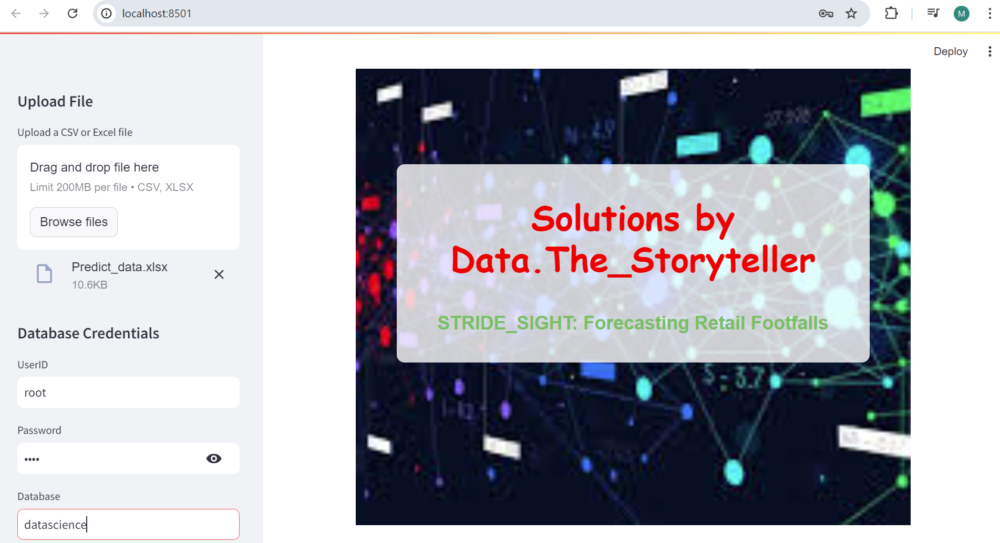
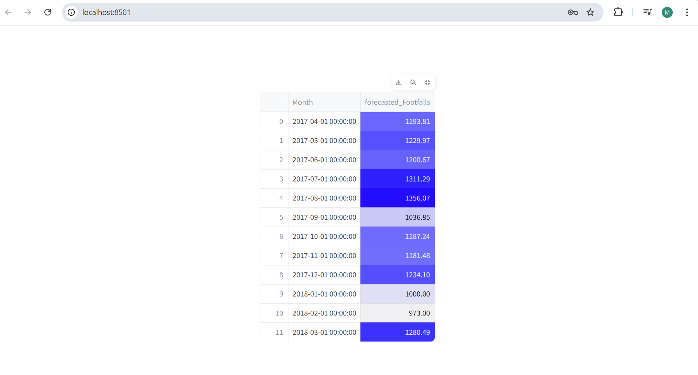

# STRIDE_SIGHT: Forecasting Retail Footfalls for Smart Inventory Management
## Overview
 STRIDE_SIGHT is a data-driven application developed to forecast retail footfalls, enabling smart inventory management by optimizing stock levels based on expected customer visits. The project employs regression models to capture trends and seasonality in footfall data, ensuring that stores can proactively adjust inventory, minimizing the risks of overstocking or understocking

## Business Problem Statement:

### Client (SuperMart) is unable to maintain optimal product stock levels because they do not know how many customers will visit their stores each month.

## Business Objective: Maximize Customer Satisfication
## Business Constraints: Minimize the number of customer service agents

## Success Criteria:
### `Business Success Criteria:` Increase the number of footfalls by at least 20%
### `ML Success Criteria:` Achieve an accuracy of at least 85%
### `Economic Success Criteria:` Achieve an increase in revenue by at least $100K

## *`CRISP-ML(Q)`* process model describes six phases:
### 1. Business and Data Understanding
### 2. Data Preparation
### 3. Model Building
### 4. Evaluation
### 5. Deployment
### 6. Monitoring and Maintenance

## Features:
### `Forecasting Model`: Uses forecasting models 
### `Model Selection`: The best model is selected based on best RMSE
### `Data Integration`: Uses SQLAlchemy with MySQL for efficient data management.
### `Web Application`: A StreamLit web application that gives the forecasted FootFall values for next 12 months
## Installation
1. **Clone the Repository**:

    `https://github.com/MounikaGandla-01/STRIDE_SIGHT.git`
    
2. **Set Up Virtual Environment**:
    
   `python3 -m venv venv`

   `source venv/bin/activate`  # On Windows, use `venv\Scripts\activate`

3. **Install Dependencies**:
   
   `pip install -r requirements.txt`

4. **Configure MySQL Database**:
   Ensure you have a MySQL database setup. Update the connection details in Model_streamlit.py as needed.

## Usage

1. **Run the Application**:
   `streamlit run Model_streamlit.py`
2. **Access the Web Application**:
   Open your web browser and navigate to `http://localhost:8501/`
3. **Upload College List**: 
   Upload a sheet of months for which FootFalls need to be forecasted

## Project Structure
### `Model_streamlit.py`: Contains the main application code for the Flask web application.
### `FootFalls_data.csv`: Data of 159 months footfalls from Jan 2004 - Mar 2017
### `Reg_model.pkl`: Forecasting regression model of Additive Seasonality Quadratic Trend file.
### `Foot_Fall_Forecasting.ipynb`: Contains the code of builing Forecasting nodel and analysis
### `venv/`: Virtual environment folder.
### `requirements.txt`: Lists the project dependencies.
### `README.md`: Project documentation.

## Data Understanding

   ###  Monthly data from Jan 2004 - Mar 2017  In total we have 159 months of data. 
  ###   We have two columns
 ###    Column 1: Date
###     Column 2: Footfalls (Target / Output) 

## Evaluation:
### MODEL	RMSE_Values
### 0	rmse_linear	209.925593
### 1	rmse_Exp	227.056263
### 2	rmse_Quad	137.154627
### 3	rmse_add_sea	264.664390
### 4	rmse_Mult_sea	273.035852
### 5	rmse_add_sea_quad	50.607246
### 6	rmse_Mult_sea_linear	177.839829

Based on the RMSE (Root Mean Squared Error) values from the different models tested, the rmse_add_sea_quad model, which has an RMSE of 50.607246, was chosen as the best model for forecasting retail footfalls.

Model Description: rmse_add_sea_quad
The rmse_add_sea_quad model combines an additive seasonal component with a quadratic trend. This means the model captures the overall upward or downward trend in footfalls, along with the seasonal variations that repeat over specific intervals (e.g., weekly, monthly).

Additive Seasonality: This component captures the regular, predictable changes in footfalls due to seasonal factors (e.g., more customers during holidays or weekends).
Quadratic Trend: Unlike a linear trend, which assumes a constant rate of increase or decrease, a quadratic trend accounts for acceleration or deceleration in footfall trends over time.
This combination allows the model to more accurately predict footfalls by accounting for both the non-linear growth pattern and the repetitive seasonal fluctuations observed in the data, leading to its superior performance as indicated by the lowest RMSE among the tested models.

## WEB APP

## Forecasting Results

